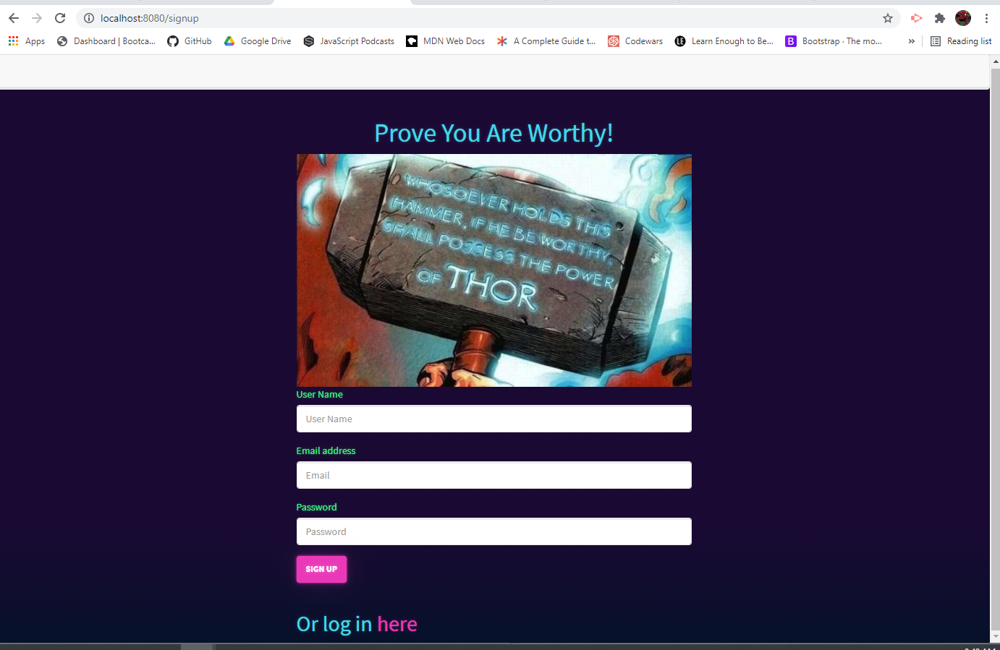
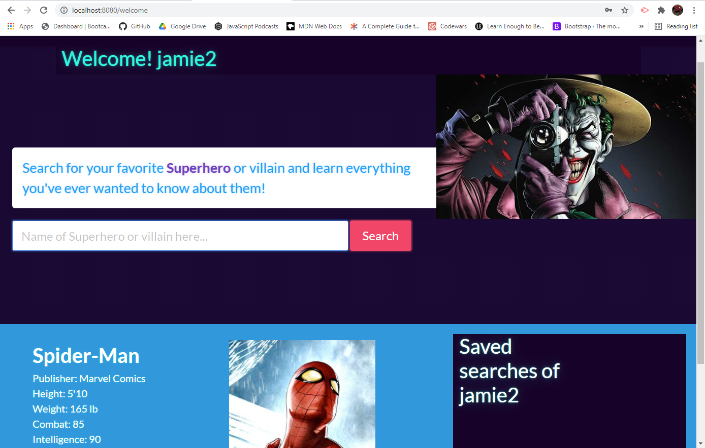

# Project 2: Comic Source Reborn!
  

## Table of Contents

- [Overview](#overview)
- [Team Members](#group-5-team-members)
- [Technologies Used](#technologies-used)
- [Key Topics](#key-topics)
- [Screenshots and site link](#screenshots-and-site-link)

## Overview

Welcome to Project 2! This is yet another important milestone in your full-stack journey: designing and building your first full-stack web application. You and your team will design and build an app using the MVC paradigm, create your own server-side API, add user authentication, and connect to a database.

## Group 5 Team Members
#### [Saqueb Khan](https://github.com/SaquebKhan)
#### [Jorge Viera](https://github.com/Jorgevier)
#### [Jamie Kaczor](https://github.com/JamieKaczor)

## Technologies Used
- HTML5
- CSS3
- Bootstrap CSS Framework
- Bulma CSS Framework
- Javascript
- JQuery
- Google Fonts
- bcrypt(Blowfish cipher)
- express
- express-session
- Sequelize
- MySQL
- Passport

## Key Topics

The following topics will be covered in this unit:

* Full-stack applications

* [Git branching workflow](https://git-scm.com/book/en/v2/Git-Branching-Branching-Workflows)

* [Agile software development](https://en.wikipedia.org/wiki/Agile_software_development)

* Collaborative development

## Screenshots and site link

# https://comicsource.herokuapp.com/

